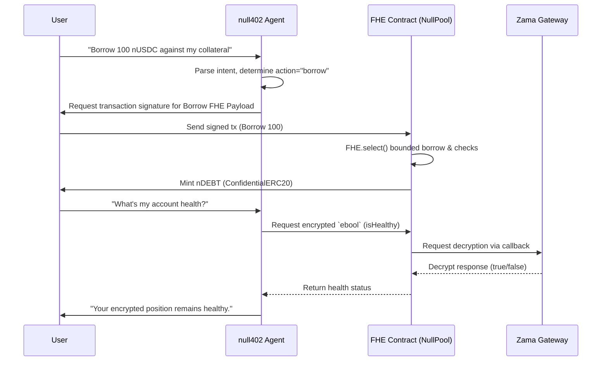

# null402

**Agentic x402 private lending protocol on Ethereum. Powered by [Zama fhEVM](https://docs.zama.ai/fhevm).**

> Your collateral. Your debt. Your health factor. **All null to everyone else.**

---

## The Problem

Every major DeFi lending protocol (Aave, Compound, Morpho) stores user positions in **plaintext**. Bots and liquidators can read your exact collateral-to-debt ratio in real time. The moment your position approaches the liquidation threshold, they sweep you. Complex multi-step actions on these protocols also require manual transaction sequencing.

## The null402 Approach

null402 is an **agentic private lending protocol**. It combines an intelligent LLM-based agent (null402) with Fully Homomorphic Encryption (FHE) integers native to the Zama fhEVM. 

Not only can you interact with the protocol entirely through natural language, but the protocol itself computes solvency checks **entirely in encrypted space** using FHE operations, without ever decrypting user values on-chain.

```
FHE.ge(collateral × LTV, debt_with_interest)  →  ebool (healthy?)
```

The result is an encrypted boolean. **Only that boolean outcome** is ever decrypted via the Zama Gateway — not your amounts.

---

## Agentic FHE Sequence Diagram



---

## Architecture

```
/contracts
  NullPool.sol        ← Core lending: deposit, borrow, repay, withdraw, health check
  NullOracle.sol      ← Wraps Chainlink plaintext prices for FHE-compatible use
  NullLiquidator.sol  ← Permissionless trigger — anyone calls, no data gained
  NullToken.sol       ← nDEBT: ConfidentialERC20 debt tracking token
  interfaces/         ← IConfidentialERC20

/frontend
  app/page.tsx        ← Landing page — "Your Position Is Null"
  app/chat/           ← null402 Agentic Chat Interface
  app/borrow/         ← Deposit / Borrow / Repay / Withdraw UI
  app/dashboard/      ← Encrypted position viewer + health check trigger
  components/ui/EncryptedValue.tsx  ← Core [encrypted] badge component
  lib/contracts.ts    ← ABIs and addresses
  lib/fhevm.ts        ← fhEVM encrypt/decrypt SDK wrapper
  lib/wagmi.ts        ← Wagmi v2 config for Sepolia
```

---

## Quick Start

### Frontend

```bash
cd frontend
npm install
cp .env.local.example .env.local   # fill in contract addresses after deploy
npm run dev                         # http://localhost:3000
```

### Contracts

```bash
cd contracts
npm install
cp .env.example .env   # add PRIVATE_KEY and RPC_URL
npm run compile
npm run deploy:sepolia
```

---

## Environment Variables

### `frontend/.env.local`

```
NEXT_PUBLIC_NULL_POOL_ADDRESS=0x...
NEXT_PUBLIC_NULL_ORACLE_ADDRESS=0x...
NEXT_PUBLIC_NULL_LIQUIDATOR_ADDRESS=0x...
NEXT_PUBLIC_NULL_TOKEN_ADDRESS=0x...
NEXT_PUBLIC_COLLATERAL_TOKEN_ADDRESS=0x...
NEXT_PUBLIC_RPC_URL=https://rpc.sepolia.org
NEXT_PUBLIC_FHEVM_GATEWAY_URL=https://gateway.sepolia.zama.ai
GEMINI_API_KEY=AIza...
```

---

## Design System

- **Background:** `#0A0A0A` (void black)
- **Accent:** `#FFE500` (attention yellow)
- **Headings:** Space Grotesk 700–800 uppercase
- **Code/Data:** Space Mono
- **Encrypted values:** `[encrypted]` badge in yellow Space Mono
- **Corners:** 12–16px rounded
- **Style:** Confidential Brutalism — no gradients, no thin fonts, tonal layering

---

## Key Contracts

### `NullPool.sol`

- `deposit(encAmount, proof)` — encrypt ETH collateral handle, store as `euint128`
- `borrow(encAmount, proof)` — FHE.select bounded borrow, mint nDEBT
- `repay(encAmount, proof)` — burn nDEBT, decrypt-free
- `withdraw(encAmount, proof)` — health check before release
- `requestHealthCheck(address)` — async Zama Gateway FHE decryption

### `NullLiquidator.sol`

Permissionless trigger. Calls `requestHealthCheck` on pool. Liquidation bots gain **no information about position size** — just whether the encrypted boolean resolved to `false`.

---

## Tech Stack

| Layer     | Tech                              |
|-----------|-----------------------------------|
| Contracts | Solidity 0.8.27, Zama fhEVM,      |
|           | OpenZeppelin 5, Chainlink         |
| Frontend  | Next.js 14, React, Space Grotesk  |
| Web3      | Wagmi v2, Viem v2, fhevmjs        |
| AI Agent  | Google Gemini API, Agentic Parse  |
| Network   | Ethereum Sepolia (fhEVM node)     |

---

## Hackathon

Built for **PL Genesis: Frontiers of Collaboration** — Track: Privacy & Encryption.

*"Position is not hidden. It is null."*
